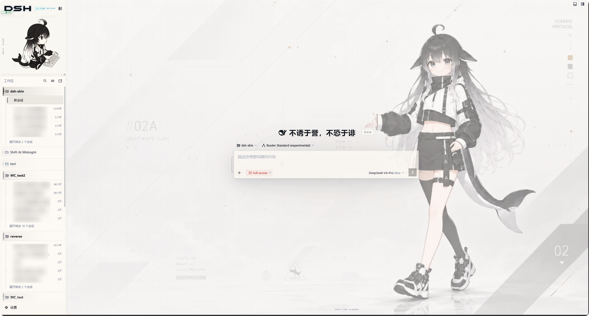

# dsh-deep-whale · Whale-Girl Skin Series

[简体中文](README.md) · **[English](README.en.md)**

Whale-girl themed skin series for the DeepSeek Harness Web GUI (standalone distribution repository).

## Previews

Click an image for the full size.

| Skin | Light mode | Dark mode |
|---|---|---|
| maid-atelier | [](maid-atelier/preview/light.webp) | [](maid-atelier/preview/dark.webp) |
| orca-link | [](orca-link/preview/light.png) | [](orca-link/preview/dark.png) |

## Residents

| Skin | Package | Description | License |
|---|---|---|---|
| [maid-atelier](maid-atelier/) | `@dsh-external/dsh-client-ui-skin-maid-atelier` | Abyssal Maid Atelier: twin-maid backdrop, deep-sea navy lace UI and a chibi sidebar | CC BY-NC-SA 4.0 |
| [orca-link](orca-link/) | `@dsh-external/dsh-client-ui-skin-orca-link` | ORCA LINK: pearl-white mechanical bay, obsidian orca operator and electric-blue link signals | CC BY-NC-SA 4.0 |
| [skin-manager](skin-manager/) | `@dsh-external/dsh-client-ui-skin-deep-whale-manager` | Generic skin discovery, switching and skin-declared settings panel | MIT |

## Copyright Holders

| Copyright holder | Copyrighted content | Corresponding skin | Profile |
|---|---|---|---|
| 上善 (Shangshan) | Original whale-girl character design | maid-atelier / orca-link | [Pixiv](https://www.pixiv.net/users/62155430) · [Bilibili（上善无形）](https://b23.tv/8h5L4xz) |
| ZipZipPipe | Whale-girl maid redesign with DeepSeek elements | maid-atelier | [Pixiv](https://www.pixiv.net/users/18604994) · [Bilibili（ZipZipPipe）](https://b23.tv/Pnw6nG8) |

\*Please file issues/feedback through the GitHub issue tracker instead of contacting the two artists directly. That said, you are welcome to check out their whale-girl works, thanks!

## Installation

> **There is exactly one correct way to install a skin: have your dsh read this repository's [INSTALL.md](INSTALL.md) (the standard installation entry point), which leads dsh to the bundled `dsh-skin-install` skill**. By default it installs skin-manager and every skin in the repository while activating only the one you choose. It stages mutual exclusion **before** adding packages, so the skins are never allowed to run simultaneously (see [Skin mutual exclusion (must read)](#skin-mutual-exclusion-must-read) and [issue #65](https://github.com/Small-tailqwq/dsh-deep-whale/issues/65)).

### Standard flow: install through INSTALL.md (recommended, the only exclusion-safe path)

1. Have your dsh read this repository's standard installation entry point:

   ```
   Read https://github.com/Small-tailqwq/dsh-deep-whale/INSTALL.md and install the skins following its guidance
   ```

2. INSTALL.md leads dsh to the bundled `dsh-skin-install` skill (if dsh cannot read remote files: `git clone` locally, then open the clone directory in dsh as the **workspace** — the skill is auto-discovered — or have it read the local `INSTALL.md` path). The skill then completes, in order: lists every skin and says **all will be installed while you choose which one to activate** → explains the attribution chain and license (CC BY-NC-SA 4.0) → **atomically stages mutual exclusion in both patch layers** → registers skin-manager and all skins using absolute paths → verifies the composed config and a cold start. First-time package registration needs one user-performed restart; later switches hot-reload without a restart.

   Already installed, or you know the target? Take the fast path: say "switch to maid-atelier" or "install orca-link" — the skill skips the survey and finishes in about 1–2 minutes.

### Skin mutual exclusion (must read)

- First, a distinction: `skin-manager` is not a skin — it is the **skin manager** (discovery, switching and customization panels) and should stay enabled permanently; mutual exclusion applies to the **skins themselves** — maid-atelier and orca-link in this repository.
- Skin enable/disable is controlled by patch layers: each of `~/.dsh/profiles/web/cordis.patch.yml` (profile layer) and `~/.dsh/cordis.patch.yml` (home layer) carries `- id: <wiring.id>` + `disabled: true/false` rows (**both layers must be written**; the home layer outranks the profile layer).
- **A skin without a `disabled` row in the patch is enabled by default.** If you install several skins at once (e.g. maid-atelier and orca-link) and never switch, they all run **simultaneously**: their decoration layers stack on top of each other and the sidebar/settings area gets mangled. Typical symptoms are **the settings button disappearing, abnormal sidebar width/layout, and a chaotic UI** (the stock UI is fine).
- skin-manager (Settings → Skin Management) writes the exclusion rows into both patch layers for you when activating; if you hand-edit the patch, keeping “only one skin enabled” requires **explicitly disabling every other skin**.
- If a marketplace or another third-party channel bypasses the standard flow, skin-manager merges the profile then home-layer states at startup. When two or more skins would be effectively enabled, it atomically falls back to "Official default"; existing safe zero-or-one-skin selections are left untouched.
- With skin-manager installed, skin customization items (e.g. the "less anime mode" visibility schedule) are stored in the current browser and applied by the manager.

### Manual installation (fallback; stage mutual exclusion first)

```sh
git clone --depth 1 https://github.com/Small-tailqwq/dsh-deep-whale   # clone anywhere (shallow is enough, skips history)
node <abs path to clone>/.agents/skills/dsh-skin-install/scripts/stage-mutual-exclusion.mjs --profile web --target maid-atelier
dsh plugin --profile web add <abs path to clone>/skin-manager   # persistent skin manager panel (recommended)
dsh plugin --profile web add <abs path to clone>/maid-atelier   # Abyssal Maid Atelier
dsh plugin --profile web add <abs path to clone>/orca-link      # ORCA LINK
```

> Run the `node` command before any `plugin add`. It preserves unrelated YAML and makes maid-atelier the only enabled skin. Use `--target orca-link` for ORCA LINK or `--target official` for the stock UI. Never overwrite the whole patch file. Skipping this staging step lets newly installed skins start enabled together.

**Option A (recommended): Settings → Skin Management → click Switch on the skin you want.** The manager writes the mutual-exclusion `disabled` rows to both patch layers and hot reloads; just refresh the page.

**Option B: hand-write both patch layers.** Append the following rows to **both** `~/.dsh/profiles/web/cordis.patch.yml` **and** `~/.dsh/cordis.patch.yml` (both are required; the home layer overrides the profile layer):

```yaml
# Example: enable only maid-atelier; for orca-link move `false` to its row — exactly one of the two skins may be false
- id: ui-skin-maid-atelier
  disabled: false
- id: ui-skin-orca-link
  disabled: true
- id: ui-skin-deep-whale-manager
  disabled: false
```

> If the patch file is still dsh's default template (comments + a single `[]` line), **replace that `[]` line entirely with the list above** — "comments + `[]` + other rows" is invalid YAML and config parsing will fail (the server keeps the last good config running; fix the file and refresh).

Windows example (forward or back slashes both work; pnpm normalizes them):
```powershell
dsh plugin --profile web add C:/Users/<you>/code/dsh-deep-whale/skin-manager
dsh plugin --profile web add C:/Users/<you>/code/dsh-deep-whale/maid-atelier
```

### Installed too many / something looks broken

Symptoms: the settings button disappears, the sidebar is covered by decoration or has an abnormal width, the UI looks chaotic (recovers once skins are disabled).

1. Open Settings → Skin Management and click "Official default" or any skin — the manager writes the exclusion rows and hot reloads; refresh to recover;
2. If the manager is unavailable (or the config file was already corrupted), run `stage-mutual-exclusion.mjs` above with `--target official` or the desired skin to recover both patch layers;
3. Or simply remove the packages you don't want: `dsh plugin --profile web remove <package>`, then re-check the exclusion rows.

### Relative path rules (common pitfall)

- Relative paths (`./`, `../`-prefixed) resolve against **the directory dsh was invoked from**, not the skin repository directory.
- **Never use a bare directory name**: `dsh plugin --profile web add maid-atelier` is treated as an npm package name, hits the registry and fails with a 404. Use `./maid-atelier` (when already inside the skin repo), `../dsh-deep-whale/maid-atelier` (when dsh-deep-whale is a sibling), or an absolute path.
- `../dsh-deep-whale/maid-atelier` after `cd <harness>` only works if **dsh-deep-whale is a sibling of your harness directory**; if you cloned elsewhere, the relative path links to the wrong place (the command succeeds silently but the skin does nothing). When in doubt, use an absolute path.

### Post-install verification

```sh
dsh plugin --profile web list          # should show @dsh-external/dsh-client-ui-skin-* as link: deps
dsh --profile web --dump-config        # skin rows appear in the composed config with correct disabled states
```
Refresh the browser to see the skin; skin toggles go through config hot reload, so no dsh restart is needed (restart only when adding/removing plugin packages).

### Install failure troubleshooting

| Symptom | Cause | Fix |
|---|---|---|
| `ERR_PNPM_FETCH_404 ... <name>` | bare directory name passed (e.g. `add maid-atelier`), treated as an npm package | use an absolute path or a `./`/`../`-prefixed path |
| command succeeds but `dsh plugin list` lacks the package | relative path resolved to the wrong location (clone location differed from assumption) | re-add with an absolute path |
| `pnpm not found on PATH` | pnpm missing from the environment | install pnpm (`npm i -g pnpm`) and retry |
| package listed but no effect on the page | skin is `disabled` (multi-skin mutual exclusion) or the browser was not refreshed | check `disabled` in `--dump-config`; refresh |

## Contributors

Thanks to the following developers for their contributions to dsh-deep-whale:

<a href="https://github.com/Small-tailqwq/dsh-deep-whale/graphs/contributors">
  
</a>

### Valuable but unmerged PRs

These PRs conflicted with the existing upstream implementation and were not merged, but their feature requests have been implemented in this repository. Thanks to:

- **@yaoyiqun** — character position switching by selected model (#15)
- **@Chartreuse310** — conversation-area serif font (#22)
- **@Vergemesh** — immediate stock/whale-girl skin switching (#27)
- **@joejojoking-cloud** — top-trim decoration layering (#26), character-stage layering (#31) fixes

> This section is maintained by hand; update it when such PRs arrive.

## License

The skins in this repository are **derivative works**, published as a whole under CC BY-NC-SA 4.0 (Attribution-NonCommercial-ShareAlike); commercial use is prohibited. See each skin's `NOTICE` for the attribution chain.

The skin scaffolding originates from [zhu1090093659/dsh-web-ui](https://github.com/zhu1090093659/dsh-web-ui); this repository distributes finished skins only and does not include the scaffolding.
