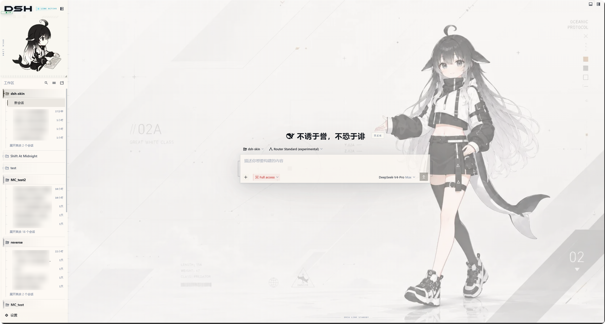

# dsh-deep-whale · Whale-Girl Skin Series

[简体中文](README.md) · **English** · [Tiếng Việt](README.vi.md)

Whale-girl themed skin series for the DeepSeek Harness Web GUI (standalone distribution repository).

## Previews

Click an image for the full size.

| Skin | Light mode | Dark mode |
|---|---|---|
| maid-atelier | [](maid-atelier/preview/light.webp) | [](maid-atelier/preview/dark.webp) |
| orca-link | [](orca-link/preview/light.png) | [](orca-link/preview/dark.png) |

## Residents

| Skin | Package | Description | License |
|---|---|---|---|
| [maid-atelier](maid-atelier/) | `@smalltailqwq/dsh-client-ui-skin-maid-atelier` | Maid Atelier: two whale maids, navy lace and a chibi sidebar turn DSH into a maid atelier | MIT (code) / CC BY-NC-SA 4.0 (artwork) |
| [orca-link](orca-link/) | `@smalltailqwq/dsh-client-ui-skin-orca-link` | ORCA LINK: a cool little black-whale operator, square corners throughout and icons redrawn in straight lines; functional by day, soothing by night | MIT (code) / CC BY-NC-SA 4.0 (artwork) |
| [skin-manager](skin-manager/) | `@smalltailqwq/dsh-client-ui-skin-deep-whale-manager` | Skin Manager: switch between installed skins and tune each skin's own options, under Settings → Skins | MIT |

## Copyright Holders

| Copyright holder | Copyrighted content | Corresponding skin | Profile |
|---|---|---|---|
| 上善 (Shangshan) | Original whale-girl character design | maid-atelier / orca-link | [Pixiv](https://www.pixiv.net/users/62155430) · [Bilibili（上善无形）](https://b23.tv/8h5L4xz) |
| ZipZipPipe | Whale-girl maid redesign with DeepSeek elements | maid-atelier | [Pixiv](https://www.pixiv.net/users/18604994) · [Bilibili（ZipZipPipe）](https://b23.tv/Pnw6nG8) |

\*Please file issues/feedback through the GitHub issue tracker instead of contacting the two artists directly. That said, you are welcome to check out their whale-girl works, thanks!

## Installation

> [!NOTE]
> If you use dsh-web (you installed `@linxin666/dsh-web-all`), install `maid-atelier` and `orca-link` from dsh-web's own skin center instead of running the commands below. The two distributions are adapted separately, and mixing them in one profile breaks the layout.

### Official desktop app

1. Choose one or more skins. Open **Plugins** in the sidebar, click **Add plugin**, and install the corresponding npm packages below one at a time.

   | Plugin | npm package name |
   |---|---|
   | [maid-atelier](https://www.npmjs.com/package/@smalltailqwq/dsh-client-ui-skin-maid-atelier) | `@smalltailqwq/dsh-client-ui-skin-maid-atelier` |
   | [orca-link](https://www.npmjs.com/package/@smalltailqwq/dsh-client-ui-skin-orca-link) | `@smalltailqwq/dsh-client-ui-skin-orca-link` |
   | [Skin Manager](https://www.npmjs.com/package/@smalltailqwq/dsh-client-ui-skin-deep-whale-manager) | `@smalltailqwq/dsh-client-ui-skin-deep-whale-manager` |

2. With **one skin**, the manager is optional; without it, the skin's customization controls are unavailable. With **multiple skins, the manager is required** to prevent them from running together and breaking the layout. Enable the plugins when prompted after installation, then **restart DSH once**.
3. If you installed Skin Manager, open **Settings → Skins** after restarting. If the first start still shows the official UI, select the skin you want to enable there.

To use the latest code on `main`, enter the GitHub specs for your chosen skins and manager in the same install field, one at a time (just the spec, without `dsh plugin add`):

```text
github:Small-tailqwq/dsh-deep-whale#main&path:/skin-manager
github:Small-tailqwq/dsh-deep-whale#main&path:/maid-atelier
github:Small-tailqwq/dsh-deep-whale#main&path:/orca-link
```

The pnpm bundled with DSH defaults to a 24-hour minimum package age, so a newly published npm version may not be available yet. GitHub sources are not subject to this npm package-age check.

The desktop app manages its own `desktop` profile; you do not need to set up a `dsh` command. The `web` commands below do not install skins into the desktop app.

### Web version installed through the CLI

Commands on this page use the `web` profile. If you launch a different CLI profile, replace `web` with that profile's name.

You can install from npm or from GitHub. Both give you the same skins; they differ in how quickly updates arrive:

| | npm (recommended) | GitHub |
|---|---|---|
| What you get | Published releases with fixed version numbers | The latest code on the `main` branch |
| When fixes reach you | Usually about 24 hours after a release (the default package-age policy in DSH's bundled pnpm) | As soon as a fix is merged |
| Network | Works with npm registry mirrors | Needs access to GitHub |

If you're not sure, pick npm. Copy the command for your shell and run it — no need to clone the repository.

**Install from npm**

```sh
# Linux / macOS / WSL
dsh plugin --profile web add '@smalltailqwq/dsh-client-ui-skin-deep-whale-manager' && dsh plugin --profile web add '@smalltailqwq/dsh-client-ui-skin-maid-atelier' && dsh plugin --profile web add '@smalltailqwq/dsh-client-ui-skin-orca-link'
```

```powershell
# PowerShell
dsh plugin --profile web add '@smalltailqwq/dsh-client-ui-skin-deep-whale-manager'; dsh plugin --profile web add '@smalltailqwq/dsh-client-ui-skin-maid-atelier'; dsh plugin --profile web add '@smalltailqwq/dsh-client-ui-skin-orca-link'
```

**Install from GitHub**

```sh
# Linux / macOS / WSL
dsh plugin --profile web add 'github:Small-tailqwq/dsh-deep-whale#main&path:/skin-manager' && dsh plugin --profile web add 'github:Small-tailqwq/dsh-deep-whale#main&path:/maid-atelier' && dsh plugin --profile web add 'github:Small-tailqwq/dsh-deep-whale#main&path:/orca-link'
```

```powershell
# PowerShell
dsh plugin --profile web add 'github:Small-tailqwq/dsh-deep-whale#main&path:/skin-manager'; dsh plugin --profile web add 'github:Small-tailqwq/dsh-deep-whale#main&path:/maid-atelier'; dsh plugin --profile web add 'github:Small-tailqwq/dsh-deep-whale#main&path:/orca-link'
```

Both sources use the same package names, so whichever you install last replaces the other. To switch sources, just run the other set of commands.

Then **restart DSH once**. If you installed the manager, open **Settings → Skins** and click **Switch** on the skin you want. From then on, switching skins takes effect immediately without restarting.

- For one skin, you can omit the other skin's and the manager's `add` commands; without the manager, customization controls are unavailable. For multiple skins, keep the manager to prevent them from running together.
- If you installed both skins, DSH still looks like the official default after the first restart. That's expected: two skins running together clash, so the manager turns both off and lets you pick one.
- Rather not type commands? Send this line to any AI assistant (or DSH itself) and it will install everything by following [INSTALL.md](INSTALL.md):

  ```
  Read https://github.com/Small-tailqwq/dsh-deep-whale/INSTALL.md and install this repository's skins as instructed
  ```

## Updating

**Desktop:** as of DSH 0.2.0-rc.2, the plugin page has no upgrade control and third-party plugins do not update automatically. Uninstall the plugin you want to update from **Plugins**, then follow the steps above to reinstall and enable it. Restart DSH afterwards.

**CLI Web version:** keep only the package names you actually installed.

```sh
# Linux / macOS / WSL
dsh plugin --profile web update @smalltailqwq/dsh-client-ui-skin-deep-whale-manager @smalltailqwq/dsh-client-ui-skin-maid-atelier @smalltailqwq/dsh-client-ui-skin-orca-link
```

```powershell
# PowerShell
dsh plugin --profile web update '@smalltailqwq/dsh-client-ui-skin-deep-whale-manager' '@smalltailqwq/dsh-client-ui-skin-maid-atelier' '@smalltailqwq/dsh-client-ui-skin-orca-link'
```

This works for both sources: npm installs move to the newest release, GitHub installs pull the latest `main`. Refresh the page afterwards; no DSH restart is needed. If this profile contains only these skins, `dsh plugin --profile web update` updates everything at once.

The pnpm bundled with DSH prefers npm versions published at least 24 hours ago by default, so `update` may stay on an older release. To request a specific release, reinstall it with `@^<version>` after the package name; it is still subject to the current pnpm package-age policy. Version numbers are listed under [Releases](https://github.com/Small-tailqwq/dsh-deep-whale/releases):

```sh
dsh plugin --profile web add '@smalltailqwq/dsh-client-ui-skin-orca-link@^0.1.7'
```

Keep the `^`: without it the package is pinned to that exact version and later `update` runs won't upgrade it.

## Troubleshooting

**The skin disappeared after upgrading DSH**

Each skin declares the DSH versions it has been adapted to (currently the 0.1.7 and 0.2 series). When DSH moves ahead of a skin, DSH disables the skin and falls back to the official UI, so an outdated skin can't hide controls such as the input box.

Update the skins first. If no update is out yet and you'd like to keep using the old skin, open **Settings → Skins**: the disabled skin shows “Not declared for DSH x.y.z; disabled automatically”. Click **Switch** and confirm. This approval covers only the current skin version and DSH version and is checked again when either changes; you can switch back to **Official Default** at any time.

<details>
<summary>Approve from the command line</summary>

```sh
dsh plugin --profile web allow-version @smalltailqwq/dsh-client-ui-skin-orca-link@<skin version> --dsh-version <DSH version> --accept-risk
```

</details>

**The layout is broken: the settings button is gone, the sidebar is the wrong width, decorations overlap**

Most likely both skins are running at once. Open **Settings → Skins**, click **Official Default** or either skin, then refresh the page. If you can't reach Settings, expand [How skin exclusivity works](#mutual-exclusion) below and fix it by hand.

**Installed, but the page looks unchanged**

Refresh the browser first. If nothing changes, check in **Settings → Skins** that the skin is enabled.

See [Common install errors](#install-errors) below for more.

## Advanced

Most users won't need anything below; expand a section when you do.

<details>
<summary><b>Migrating from versions before 0.1.3</b></summary>

Versions installed from GitHub before `0.1.3` used the old `@dsh-external/*` package names. Remove these three first, then reinstall as described in [Installation](#installation); otherwise DSH keeps two copies of the same plugins:

```sh
dsh plugin --profile web remove '@dsh-external/dsh-client-ui-skin-orca-link'
dsh plugin --profile web remove '@dsh-external/dsh-client-ui-skin-maid-atelier'
dsh plugin --profile web remove '@dsh-external/dsh-client-ui-skin-deep-whale-manager'
```

Restart DSH once afterwards. Your chosen skin and its settings carry over; the rename doesn't affect them.

</details>

<details>
<summary><b>Installing from a local folder (development / testing a specific commit)</b></summary>

For local development, or to test a specific commit, clone the repository and install from its folders:

```sh
git clone --depth 1 https://github.com/Small-tailqwq/dsh-deep-whale
node <absolute clone path>/.agents/skills/dsh-skin-install/scripts/stage-mutual-exclusion.mjs --profile web --target maid-atelier
dsh plugin --profile web add <absolute clone path>/skin-manager
dsh plugin --profile web add <absolute clone path>/maid-atelier
dsh plugin --profile web add <absolute clone path>/orca-link
```

- The `node` line is optional. It picks the default skin in advance so the first start already shows it; `--target` accepts `maid-atelier`, `orca-link` or `official`. Without it, the first start shows the official UI and you pick a skin under **Settings → Skins**.
- Prefer **absolute paths**. On Windows both slash styles work, e.g. `C:/Users/<you>/code/dsh-deep-whale/maid-atelier`.
- Don't pass a bare folder name: `dsh plugin --profile web add maid-atelier` is treated as an npm package name and fails with 404. Relative paths must start with `./` or `../` and are resolved from **the folder you run dsh in**, not the skin repository. A wrong relative path won't raise an error — the skin just won't load.
- A local folder installs the same package name as the npm and GitHub sources; the last `add` wins.

</details>

<details>
<summary><a name="mutual-exclusion"></a><b>How skin exclusivity works</b></summary>

Only one skin can be active at a time. The skin manager isn't a skin and should stay enabled.

Each skin's on/off switch lives in two config files: `~/.dsh/profiles/<profile>/cordis.patch.yml` (profile layer; replace `<profile>` with the actual name, such as `web` or Desktop's `desktop`) and `~/.dsh/cordis.patch.yml` (home layer, which takes priority). A skin with no entry in these files is **on** by default, so installing both skins without ever switching leaves them running together and breaks the layout.

The skin manager takes care of this:

- On every start, if two or more skins are on, it turns them all off and returns to the official default. A single chosen skin is left alone.
- Switching in **Settings → Skins** writes the switches into both files and applies them immediately.

If the manager isn't available, edit the files yourself. Add the following to **both** files; set the skin you want to `false` and the other to `true`:

```yaml
- id: ui-skin-maid-atelier
  disabled: false
- id: ui-skin-orca-link
  disabled: true
- id: ui-skin-deep-whale-manager
  disabled: false
```

If a file still holds DSH's default template (a few comments plus a line containing `[]`), **replace** the `[]` line with the list above; keeping both makes the file invalid. You can also run `stage-mutual-exclusion.mjs` from the previous section to write this for you, or uninstall the skin you don't use with `dsh plugin --profile web remove <package>`.

Per-skin preferences (such as the active hours of "less-anime mode") are stored in the current browser and applied by the manager.

</details>

<details>
<summary><b>Checking that the install worked</b></summary>

**Desktop:** check that the packages you installed appear in **Plugins**, then restart and check the skin. If you installed the manager, choose a skin under **Settings → Skins**. The desktop app's `desktop` profile does not support CLI `--dump-config`; skip the commands below.

**CLI Web version:**

```sh
dsh plugin --profile web list          # should list the packages you chose to install
dsh --profile web --dump-config        # chosen skin is disabled: false; the manager is too, if installed
```

Right after installing and before restarting, both skins may show as enabled. That's normal; the manager sorts it out on restart.

After restarting, you can also run this in the browser console to confirm the page actually loaded the skin scripts:

```js
document.documentElement.outerHTML.match(/\/plugins\/@smalltailqwq\/[^"'\s]+/g) ?? []
```

The result should include the active skin and the manager if you installed and enabled it; a disabled skin not appearing is expected.

</details>

<details>
<summary><a name="install-errors"></a><b>Common install errors</b></summary>

| Symptom | Cause | Fix |
|---|---|---|
| `ERR_PNPM_FETCH_404` | Misspelled package name, no network, or a bare folder name in a local install | Copy the package names from this page; use absolute paths for local installs |
| `The matching commit...` / cannot resolve ref | pnpm older than 9 doesn't support `#path:` | Upgrade pnpm: `npm i -g pnpm@latest` |
| `ERR_PNPM_EXOTIC_SUBDEP` | Installing an aggregate package that pulls further Git dependencies (a pnpm 11 safety rule; this repo ships no such package) | Install the three packages separately with the commands on this page |
| `pnpm not found on PATH` | pnpm isn't installed | `npm i -g pnpm`, then retry |
| Package installed but the page is unchanged | The skin is disabled, or the browser wasn't refreshed | Enable it under Settings → Skins, then refresh |
| PowerShell command cut off or failing | Unquoted package name; everything after `#` was treated as a comment | Always wrap package names in single quotes |

</details>

## Contributors

Thanks to the following developers for their contributions to dsh-deep-whale:

<a href="https://github.com/Small-tailqwq/dsh-deep-whale/graphs/contributors">
  
</a>

### Valuable but unmerged PRs

These PRs conflicted with the existing upstream implementation and were not merged, but their feature requests have been implemented in this repository. Thanks to:

- **@yaoyiqun** — character position switching by selected model (#15)
- **@Chartreuse310** — conversation-area serif font (#22)
- **@Vergemesh** — immediate stock/whale-girl skin switching (#27)
- **@joejojoking-cloud** — top-trim decoration layering (#26), character-stage layering (#31) fixes

> This section is maintained by hand; update it when such PRs arrive.

## License

Project-owned code is licensed under **MIT**; see [LICENSE](LICENSE) for scope. Artwork copyright and existing permissions remain with the original authors. All artwork in both skins, including AI-generated and AI-assisted images, remains under CC BY-NC-SA 4.0; **commercial use is prohibited**; see each skin's `NOTICE` and `LICENSE-ARTWORK`. Images embedded in source, CSS, or generated bundles remain outside MIT. Third-party materials retain their applicable licenses, and permissions already granted for earlier versions are not revoked.

The skin scaffolding originates from [zhu1090093659/dsh-web-ui](https://github.com/zhu1090093659/dsh-web-ui); this repository distributes finished skins only and does not include the scaffolding.
